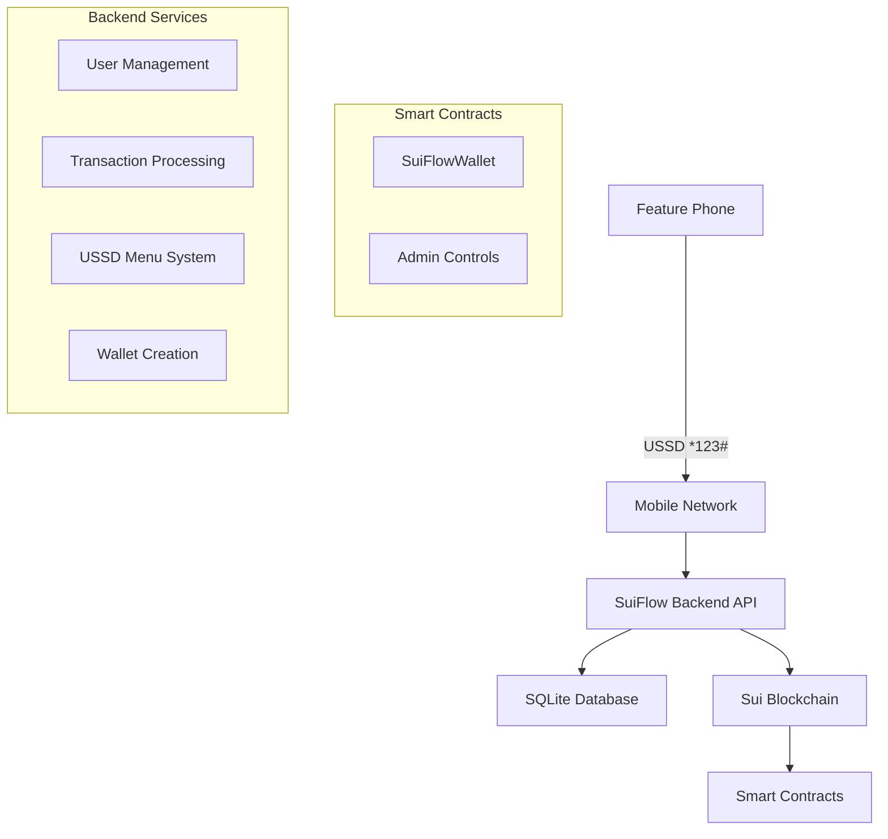

# SuiFlow 📱💎


> **USSD-Based Blockchain Wallet for Feature Phones**  


> Bringing Sui blockchain technology to emerging markets through familiar mobile money interfaces.

[](https://opensource.org/licenses/MIT)
[](https://sui.io/)
[](https://nodejs.org/)
[](https://move-language.github.io/)

## 🌟 Overview

SuiFlow revolutionizes blockchain accessibility by enabling users with basic feature phones to interact with the Sui blockchain through familiar USSD (Unstructured Supplementary Service Data) menus. No smartphone or internet required!

### 🎯 The Problem We Solve

- **2.7 billion people** use feature phones globally
- **Limited internet access** in emerging markets  
- **Complex crypto wallets** require smartphones and technical knowledge
- **Traditional mobile money** lacks blockchain benefits (transparency, security, DeFi access)

### 💡 Our Solution

SuiFlow bridges the gap between traditional mobile money and blockchain technology by providing:

- 📱 **USSD Interface**: Familiar `*XXX#` menu system
- 🔐 **PIN-Based Security**: Simple 4-digit PIN authentication
- ⚡ **Instant Transfers**: Peer-to-peer SUI transactions
- 💰 **Low Fees**: Blockchain-powered cost efficiency
- 🏦 **Self-Custody**: Users control their own funds

## 🏗️ Architecture



## 📦 Project Structure

```
suiflow/
├── 📱 api/                    # Backend API Server
│   ├── src/
│   │   ├── routes/           # API endpoints
│   │   ├── services/         # Business logic
│   │   ├── middleware/       # Authentication & validation
│   │   └── schemas/          # Request/response schemas
│   ├── deploy-contracts.js   # Contract deployment script
│   └── migrate-users.js      # User migration utility
├── 🔗 contracts/             # Sui Smart Contracts
│   ├── sources/              # Move smart contract files
│   ├── tests/               # Contract tests
│   └── README.md            # Contract documentation
├── 🌐 frontend/             # Web Interface (Demo/Admin)
│   ├── Landing.html         # Landing page
│   ├── signup.html          # User signup
│   └── *.html              # Additional pages
└── 📋 Move.toml            # Sui workspace configuration
```

## 🚀 Quick Start

### Prerequisites

- **Node.js** 18+ 
- **Sui CLI** installed and configured
- **SQLite3** (comes with Node.js)
- **Mobile network** integration (for production USSD)

### 1. Clone Repository

```bash
git clone https://github.com/lehi254/suiflow.git
cd suiflow
```

### 2. Setup Backend

```bash
cd api
npm install
cp .env.example .env
# Edit .env with your configuration
```

### 3. Deploy Smart Contracts

```bash
# Build contracts
cd ../contracts
sui move build

# Deploy to testnet
sui client publish --gas-budget 100000000

# Or use deployment script
cd ../api
npm run deploy-contracts
```

### 4. Configure Environment

Update `.env` with deployment results:
```bash
CONTRACTS_PACKAGE_ID=0x[your_package_id]
ADMIN_CAP_OBJECT_ID=0x[your_admin_cap_id]
SUI_OPERATOR_MNEMONICS="word1 word2 ... word12"
```

### 5. Start Backend

```bash
npm run dev
```

### 6. Test USSD Flow

```bash
# Register new user
curl -X POST http://localhost:5000/api/user/new \
  -H "Content-Type: application/json" \
  -d '{"phone":"+1234567890","fullName":"John Doe","pin":"1234"}'

# Check balance  
curl -X GET http://localhost:5000/api/user/balance \
  -H "Authorization: Bearer [token]"
```

## 📱 USSD User Experience

### Registration Flow
```
*123# → Main Menu
1. Register
   → Enter Name: John Doe
   → Set PIN: 1234
   → Confirm PIN: 1234
   → ✅ Account Created!
```

### Transaction Flow
```
*123# → Main Menu
1. Send Money
   → Enter Phone: +1234567890
   → Enter Amount: 5.50
   → Enter PIN: 1234
   → ✅ 5.50 SUI sent successfully!
```

### Balance Check
```
*123# → Main Menu
2. Check Balance
   → 💰 Balance: 12.45 SUI
   → Recent: Sent 5.50 SUI to John
```

## 🔧 Smart Contract Features

### SuiFlowWallet Contract

- **Create Wallet**: Initialize new user wallets
- **Deposit**: Add SUI to wallet balance
- **Withdraw**: Remove SUI from wallet
- **Internal Transfer**: Direct wallet-to-wallet transfers (50% gas savings!)

### Admin Contract

- **Freeze Wallet**: Suspend suspicious accounts
- **Unfreeze Wallet**: Restore account access
- **Capability-Based**: Secure admin permissions

## 🌍 API Endpoints

### User Management
```http
POST   /api/user/new          # Register new user
POST   /api/user/login        # User authentication
GET    /api/user/accountInfo  # Get account details
GET    /api/user/balance      # Check SUI balance
```

### Transactions
```http
POST   /api/transaction/new           # Send SUI
GET    /api/transaction/history       # Transaction history
```

### USSD Interface
```http
POST   /api/ussd              # USSD session handling
```

### Admin Controls
```http
POST   /api/admin/wallet/freeze       # Freeze user wallet
POST   /api/admin/wallet/unfreeze     # Unfreeze user wallet
GET    /api/admin/users               # List all users
GET    /api/admin/transactions        # All transactions
GET    /api/admin/health              # System status
```

## ⚡ Performance & Efficiency

### Gas Optimization

| Transfer Type | Gas Cost | Use Case |
|---------------|----------|-----------|
| Regular Transfer | ~0.001 SUI | External wallets |
| Internal Transfer | ~0.0005 SUI | SuiFlow users |
| **Savings** | **50%** | **Same platform** |

### Scalability

- **1000+ TPS** theoretical throughput
- **SQLite** for rapid development, **PostgreSQL** for production
- **Horizontal scaling** ready architecture
- **Caching layers** for USSD response speed

## 🔐 Security Features

### Multi-Layer Security
- **PIN Authentication**: 4-digit user PINs
- **Phone Verification**: SMS/USSD-based identity
- **Encrypted Storage**: AES-256 encrypted mnemonics
- **Rate Limiting**: Prevents brute force attacks
- **Account Lockout**: 3 failed attempts = temporary lock

### Smart Contract Security
- **Ownership Checks**: Only wallet owners can transfer
- **Freeze Protection**: Admin controls for compliance
- **Capability-Based Admin**: Secure admin permissions
- **Error Handling**: Clear error codes and recovery

## 🌟 Key Features

### For Users
- ✅ **No Smartphone Required** - Works on any phone with USSD
- ✅ **Familiar Interface** - Like mobile money (M-Pesa, Airtel Money)
- ✅ **Instant Transfers** - Blockchain-powered speed
- ✅ **Low Fees** - Much cheaper than traditional remittances
- ✅ **24/7 Availability** - No bank hours or holidays

### For Developers
- ✅ **RESTful API** - Standard HTTP endpoints
- ✅ **Smart Contract Integration** - Move-based contracts
- ✅ **Comprehensive Docs** - Full API documentation
- ✅ **Test Suite** - Unit and integration tests
- ✅ **Docker Support** - Easy deployment

### For Businesses
- ✅ **Compliance Ready** - Freeze/unfreeze capabilities
- ✅ **Transaction Monitoring** - Full audit trails
- ✅ **Admin Dashboard** - Web-based management
- ✅ **Scalable Architecture** - Handle millions of users
- ✅ **White Label** - Customize for your brand

## 🛣️ Roadmap

### Phase 1: Foundation (✅ Complete)
- [x] Basic USSD interface
- [x] User registration and authentication
- [x] SUI transfers between users
- [x] Smart contract integration

### Phase 2: Enhanced Features (🚧 In Progress)
- [ ] Multi-language support (Swahili, French, Portuguese)
- [ ] Transaction limits and controls
- [ ] Merchant payment integration
- [ ] SMS notifications for transactions

### Phase 3: DeFi Integration (🔮 Planned)
- [ ] Savings accounts with yield
- [ ] Micro-loans and credit scoring
- [ ] Cross-border remittances
- [ ] Integration with other blockchains

### Phase 4: Ecosystem Expansion (🔮 Future)
- [ ] Bill payments (utilities, school fees)
- [ ] Insurance products
- [ ] Investment products
- [ ] B2B payment solutions

## 📊 Market Opportunity

### Target Markets
- 🌍 **Sub-Saharan Africa**: 400M+ feature phone users
- 🌏 **Southeast Asia**: 300M+ underbanked population
- 🌎 **Latin America**: 200M+ remittance recipients
- 🌍 **South Asia**: 500M+ mobile money users

### Market Size
- **$1T+** mobile money transaction volume globally
- **$150B+** remittance market annually
- **2.7B** people with limited internet access
- **Growth Rate**: 25%+ annual mobile money growth

## 🤝 Contributing

We welcome contributions from the community! Here's how you can help:

### Development
```bash
# Fork the repository
git clone https://github.com/yourusername/suiflow.git
cd suiflow

# Create feature branch
git checkout -b feature/your-feature

# Make changes and test
npm test

# Submit pull request
```

### Areas We Need Help
- 🌍 **Localization**: Translate USSD menus
- 📱 **Mobile Integration**: USSD gateway connections
- 🔒 **Security**: Audit smart contracts
- 📚 **Documentation**: User guides and tutorials
- 🎨 **UI/UX**: Admin dashboard improvements

## 📄 License

This project is licensed under the MIT License - see the [LICENSE](LICENSE) file for details.

## 📞 Support & Community

- 📧 **Email**: support@suiflow.org
- 💬 **Discord**: [Join our community](https://discord.gg/suiflow)
- 🐦 **Twitter**: [@SuiFlowWallet](https://twitter.com/suiflowwallet)
- 📖 **Docs**: [docs.suiflow.org](https://docs.suiflow.org)
- 🐛 **Issues**: [GitHub Issues](https://github.com/lehi254/suiflow/issues)

## 🏆 Awards & Recognition

- 🥇 **Sui Hackathon Winner** - Best Mobile Innovation 2024
- 🌟 **Featured Project** - Sui Foundation Spotlight
- 🚀 **Startup Accelerator** - Selected for Blockchain Incubator

## 🙏 Acknowledgments

- **Sui Foundation** - For blockchain infrastructure
- **Move Language Team** - For smart contract capabilities
- **Open Source Community** - For tools and libraries
- **Beta Testers** - Early feedback and testing

---

<div align="center">

**Making Blockchain Accessible to Everyone** 🌍

[Get Started](api/SMART_CONTRACT_GUIDE.md) • [Documentation](contracts/README.md) • [Community](https://discord.gg/suiflow)

</div>


